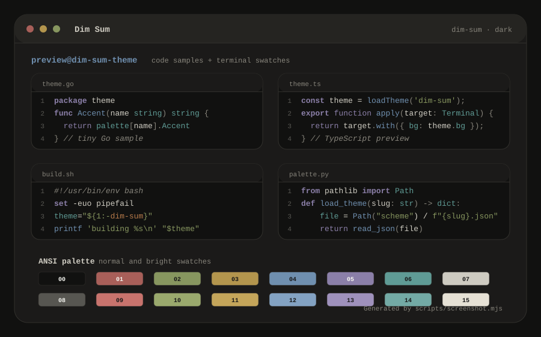
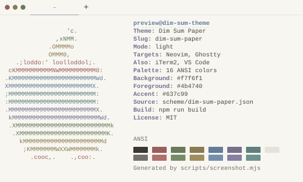
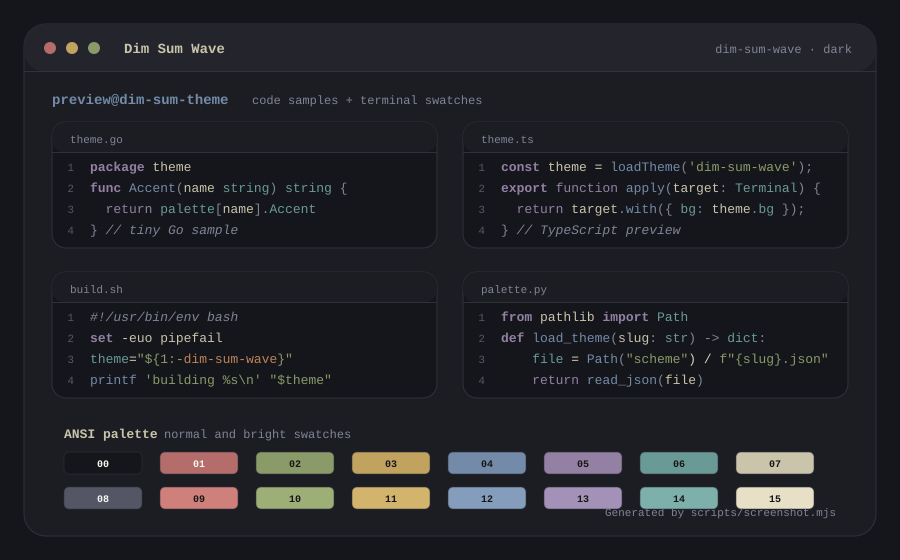
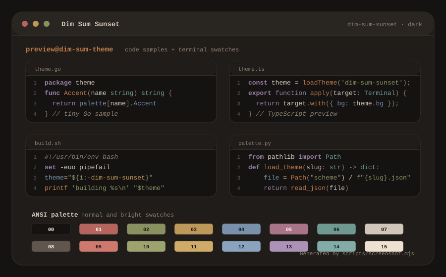
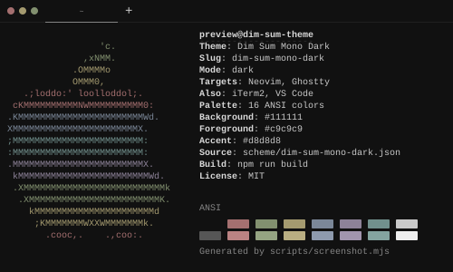
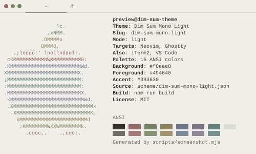

<p align="center">
  
</p>

<h1 align="center">Dim Sum</h1>

<p align="center">
  A family of dim themes for terminals and editors. The palettes favor calm UI surfaces, muted syntax colors, and only subtle warmth.
</p>

Supported targets:

- Neovim
- Ghostty
- iTerm2
- VS Code

## Variants

### Dim Sum



### Dim Sum Paper

A barely-white, steam-bun-paper light variant.



### Dim Sum Wave

An ink-and-wave dark variant.



### Dim Sum Sunset

A dim dark variant with subtle dusk warmth and ember accents.



### Dim Sum Mono Dark



### Dim Sum Mono Light



Available slugs:

```text
dim-sum
dim-sum-paper
dim-sum-wave
dim-sum-sunset
dim-sum-mono-dark
dim-sum-mono-light
```

## Install

Clone the repository first:

```sh
git clone https://github.com/dawidsok/dim-sum-theme.git ~/.local/share/dim-sum-theme
cd ~/.local/share/dim-sum-theme
```

Generated theme files are committed in `dist/`, so you can use the themes without running a build.

### Neovim

Copy or symlink the generated colorscheme into your config. Replace `dim-sum` with any variant slug.

```sh
mkdir -p ~/.config/nvim/colors
ln -sf "$PWD/dist/neovim/colors/dim-sum.lua" ~/.config/nvim/colors/dim-sum.lua
```

Then use:

```vim
:colorscheme dim-sum
```

With lazy.nvim:

```lua
{
  "dawidsok/dim-sum-theme",
  name = "dim-sum",
  lazy = false,
  priority = 1000,
  rtp = "dist/neovim",
  config = function()
    vim.cmd.colorscheme("dim-sum")
  end,
}
```

### Ghostty

```sh
mkdir -p ~/.config/ghostty/themes
ln -sf "$PWD/dist/ghostty/dim-sum" ~/.config/ghostty/themes/dim-sum
```

In `~/.config/ghostty/config`:

```ini
theme = dim-sum
```

### iTerm2

Import any file from `dist/iterm/`:

1. iTerm2 → Settings → Profiles → Colors
2. Color Presets… → Import…
3. Select the `.itermcolors` file for the variant you want

### VS Code

Symlink or copy the generated extension folder:

```sh
mkdir -p ~/.vscode/extensions
ln -sfn "$PWD/dist/vscode" ~/.vscode/extensions/dim-sum-theme
```

Then run **Developer: Reload Window** and choose a Dim Sum variant from the color theme picker.

## Build

Requirements:

- Node.js 20 or newer
- npm

```sh
npm ci
npm run build
npm run check
```

Theme definitions live in `scheme/*.json`. `scripts/generate.mjs` generates target-specific files in `dist/`, and `scripts/screenshot.mjs` generates terminal-style screenshots in `assets/screenshots/`.

## Security

This project has no runtime dependencies. The CI workflow runs `npm audit --audit-level=high` and verifies generated files are up to date. To report a vulnerability, see [SECURITY.md](SECURITY.md).

## License

MIT © Dawid Sokół
